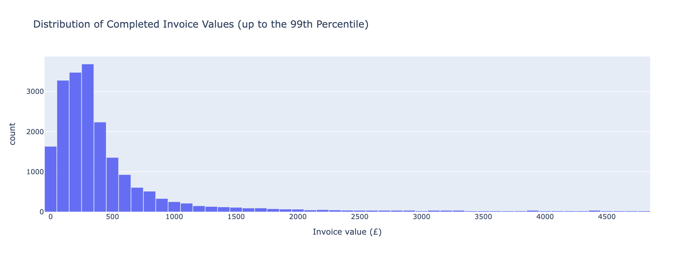
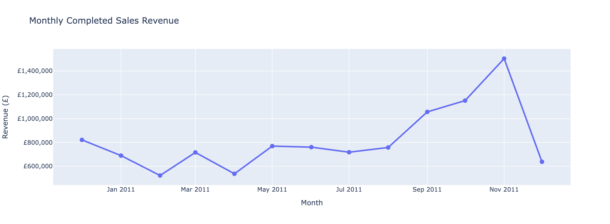
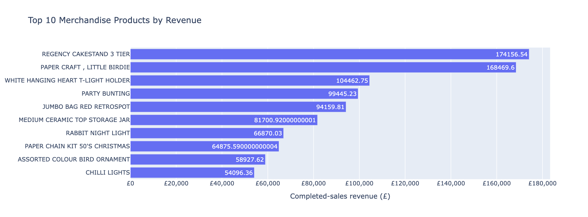
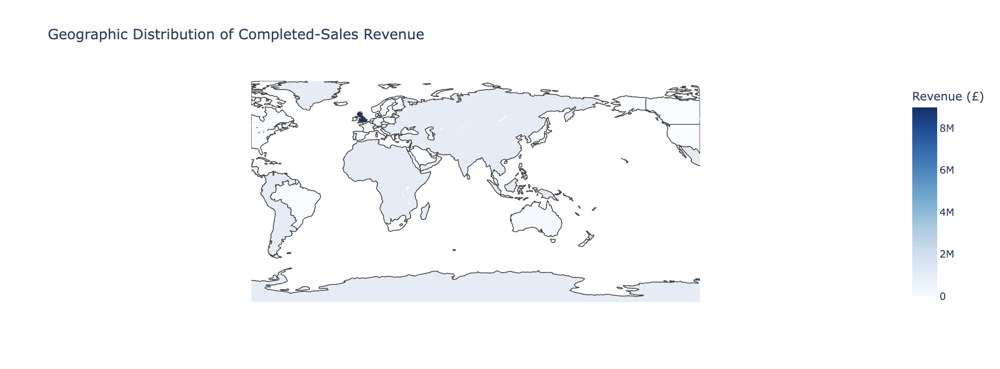
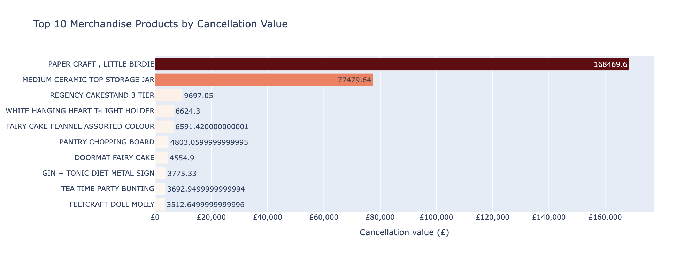
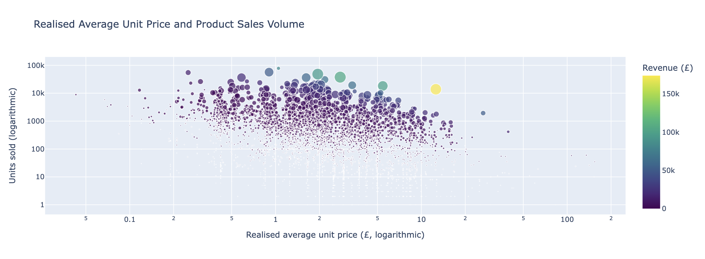
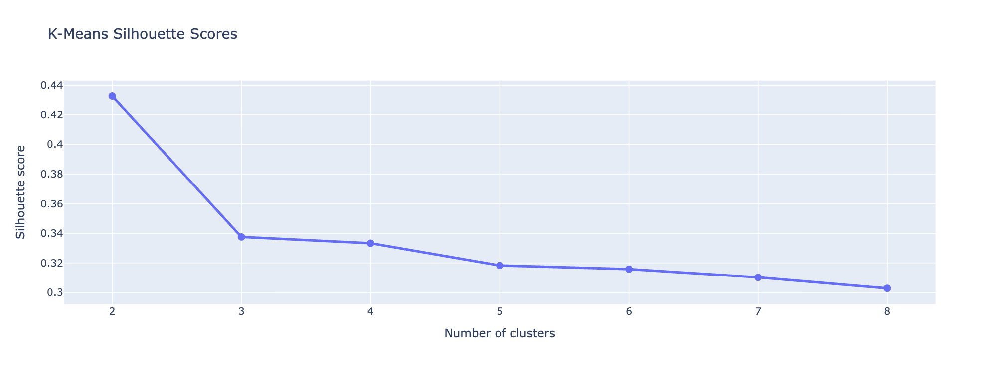
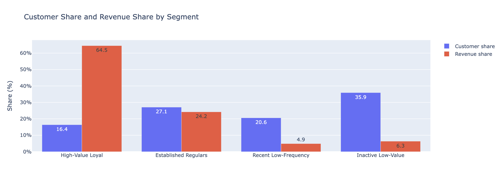

# Retail: Online Retail Transaction Analysis (ORTA)

## Project overview

Retail: ORTA is an online retail data analytics project designed to help sales and marketing teams understand customer behaviour, product performance, geographic markets, cancellations, and sales trends.

The project uses historical transaction data from a UK-based online retailer. The analysis is documented in Jupyter Notebooks and presented through an interactive Streamlit dashboard.

The application helps retail decision-makers identify valuable customer groups, popular products, important markets, cancellation patterns, and potential marketing opportunities.

**Live application:**  
[Launch the Online Retail Transaction Analysis dashboard](https://ewa-ci-online-retail-analysis-ca5f9bbb68ba.herokuapp.com/)

**GitHub repository:**  
[View the project source code](https://github.com/Ellusive89/CI-DA-Project-2-Online-Retail-Transaction-Analysis)

## Table of contents

- [Project overview](#project-overview)
- [Business problem](#business-problem)
- [Project rationale](#project-rationale)
- [Target audience](#target-audience)
- [Business requirements](#business-requirements)
- [Dataset](#dataset)
- [Data analysis objectives](#data-analysis-objectives)
- [Analytical methodology](#analytical-methodology)
- [ETL pipeline](#etl-pipeline)
- [Key analysis findings](#key-analysis-findings)
- [Hypothesis testing](#hypothesis-testing)
- [Machine learning](#machine-learning)
- [Streamlit dashboard](#streamlit-dashboard)
- [Project structure](#project-structure)
- [UX design and accessibility](#ux-design-and-accessibility)
- [Technologies used](#technologies-used)
- [Local installation](#local-installation)
- [Testing](#testing)
- [Deployment](#deployment)
- [Limitations and future development](#limitations-and-future-development)
- [Learning reflection](#learning-reflection)
- [Learning outcome mapping](#learning-outcome-mapping)
- [Credits and references](#credits-and-references)
- [Acknowledgements](#acknowledgements)

## Business problem

Online retailers collect large volumes of transaction data, but raw transaction records do not directly explain:

- which customers are most valuable;
- which products generate the most sales;
- how revenue changes over time;
- which countries represent important markets;
- how cancellations affect business performance;
- which customer groups should receive different marketing treatments.

Retail: ORTA will transform the raw transaction data into understandable business insights and interactive decision-support tools.

## Project rationale

The project addresses a realistic retail analytics problem. Sales and marketing teams need reliable information to plan campaigns, prioritise customers, understand demand, and evaluate product performance.

The project combines descriptive statistics, probability, hypothesis testing, exploratory analysis, machine learning, and interactive visualisation. This provides both analytical evidence and a practical tool for a real-world audience.

The project will not describe revenue as profit because the dataset does not contain product cost, fulfilment cost, marketing cost, or operating expenses.

## Target audience

The primary users are:

- e-commerce sales managers;
- marketing managers;
- customer relationship managers;
- product and pricing teams.

Users are expected to understand retail performance but should not need technical knowledge of Python or machine learning.

## Business requirements

The project answers the following business questions:

1. What is the total completed sales revenue?
2. How does revenue change over time?
3. What is the average completed transaction value?
4. Which products generate the most revenue?
5. Which products sell the greatest number of units?
6. Which geographic markets generate the most revenue?
7. How many invoices are cancellations?
8. What customer groups can be identified from purchasing behaviour?
9. How do the identified customer groups differ?
10. Which products and marketing treatments may be appropriate for each group?
11. How could different campaign assumptions affect estimated revenue?

## Dataset

The project uses the Online Retail Transactions dataset.

Kaggle source:

https://www.kaggle.com/datasets/abhishekrp1517/online-retail-transactions-dataset


The dataset contains transactions from a UK-based non-store retailer between December 2010 and December 2011.

The principal fields are:

| Field | Description |
|---|---|
| `InvoiceNo` | Identifier assigned to an invoice |
| `StockCode` | Product identifier |
| `Description` | Product description |
| `Quantity` | Number of product units |
| `InvoiceDate` | Date and time of the transaction |
| `UnitPrice` | Price per unit in pounds sterling |
| `CustomerID` | Customer identifier |
| `Country` | Customer country |

Invoice numbers beginning with `C` represent cancellations.

The dataset does not contain product cost, product category, customer demographics, marketing-channel information, or profit.

## Data analysis objectives

The analysis:

- inspect the structure and quality of the raw data;
- identify missing values, duplicates, cancellations, and unusual values;
- create a reproducible ETL pipeline;
- calculate line revenue using quantity multiplied by unit price;
- separate completed sales from cancellations and returns;
- calculate descriptive statistics;
- calculate relevant empirical probabilities;
- investigate sales trends over time;
- compare product and geographic performance;
- test business hypotheses;
- create customer-level RFM features;
- apply customer-segmentation machine learning;
- communicate findings through interactive Plotly charts;
- provide actionable but appropriately qualified recommendations.

## Analytical methodology

The project follows a structured data analytics workflow:

1. **Business understanding:** define the retail questions, users, objectives, limitations, and required outputs.
2. **Data extraction:** load the supplied raw CSV without altering its original contents.
3. **Data transformation:** inspect quality, remove exact duplicates, label missing descriptions, classify transaction types, and create analytical features.
4. **Data loading:** export validated purpose-specific Parquet datasets.
5. **Exploratory data analysis:** analyse sales, products, time periods, geographic markets, cancellations, and invoice values.
6. **Statistical analysis:** apply descriptive statistics, empirical probability, hypothesis testing, correlation, and effect-size measurement.
7. **Machine learning:** create RFM customer features and apply K-Means clustering.
8. **Application development:** communicate results through a multipage Streamlit dashboard with interactive Plotly visualisations.
9. **Decision support:** provide an assumption-based marketing campaign planner.
10. **Evaluation:** explain model performance, analytical limitations, and appropriate use of the results.

Completed sales are analysed separately from cancellations and operational adjustments. Customer-level analysis uses only identifiers considered reliable.

The project uses both descriptive and inferential methods. Descriptive methods summarise the historical dataset, while hypothesis tests assess whether observed relationships are unlikely under specified null hypotheses. Neither method automatically demonstrates causation.

## ETL pipeline

The ETL pipeline is documented in `jupyter_notebooks/01_ETL_Data_Cleaning.ipynb`.

### Extract

The original CSV is loaded into `df_raw`. It contains:

- 541,909 rows;
- 8 original columns;
- transactions between December 2010 and December 2011.

The raw DataFrame remains available for comparison throughout the notebook. All cleaning and feature engineering are performed on a separate copy.

### Transform

The transformation process:

- removes 5,268 exact duplicate rows;
- converts invoice dates to a datetime format;
- strips unnecessary whitespace from text columns;
- labels 1,454 missing descriptions as `UNKNOWN DESCRIPTION`;
- identifies invoice numbers beginning with `C` as cancellations;
- identifies negative quantities, zero prices, and negative prices;
- creates a `TransactionType` classification;
- calculates `LineRevenue` as `Quantity * UnitPrice`;
- creates day, month, year, weekday, hour, and weekend features;
- identifies customer records suitable for customer-level analysis.

The transformed data contains 536,641 deduplicated and classified rows.

### Transaction classification

The transformed transactions are separated into:

| Transaction type | Rows |
|---|---:|
| Completed sale | 524,878 |
| Cancellation | 9,251 |
| Return or negative quantity | 1,336 |
| Zero-price transaction | 1,174 |
| Accounting adjustment | 2 |

Negative-quantity rows with zero prices are retained as operational adjustments rather than automatically described as monetary customer returns.

### Customer identifier limitation

Customer identifier `15287` occurs 135,101 times, representing approximately 24.93% of the raw dataset. It appears across thousands of invoices, several
countries, and thousands of products. It is also equal to the dataset's median customer identifier.

This pattern suggests that the supplied CSV may use `15287` as a replacement for transactions where the original customer identifier was unknown.

The associated valid transactions remain included in sales, product, time, and geographic analysis. Identifier `15287` is excluded from RFM segmentation
because treating it as one real customer would severely distort customer-level results.

### Load

The ETL notebook exports four validated Parquet datasets:

| Dataset | Purpose | Rows |
|---|---|---:|
| `transactions_clean.parquet` | All deduplicated and classified rows | 536,641 |
| `completed_sales.parquet` | Positive completed sales | 524,878 |
| `returns_adjustments.parquet` | Cancellations and operational adjustments | 11,763 |
| `customer_sales.parquet` | Reliable customer-level completed sales | 392,672 |

Parquet preserves data types and reduces application loading time. The original raw CSV remains unchanged and committed separately.

## Key analysis findings

The exploratory analysis is documented in `jupyter_notebooks/02_Exploratory_Data_Analysis.ipynb`.

### Sales performance

The completed-sales dataset generated:

| Metric | Result |
|---|---:|
| Completed-sales revenue | £10,642,110.80 |
| Completed invoices | 19,960 |
| Mean invoice value | £533.17 |
| Median invoice value | £303.30 |
| Units sold | 5,572,420 |
| Unique products | 3,922 |
| Countries represented | 38 |

#### Invoice-value distribution



*Figure 1: Distribution of completed invoice values up to the 99th percentile.*

The distribution is strongly right-skewed. Most invoices are concentrated at lower values, while a relatively small number of large transactions extend the
upper tail. This explains why the mean invoice value of £533.17 is considerably higher than the median of £303.30. The 99th-percentile limit improves
readability without removing invoices from the KPI calculations.

#### Monthly completed-sales revenue



*Figure 2: Monthly completed-sales revenue.*

Revenue strengthened during September, October, and November 2011. November was the strongest complete month, generating approximately £1.50 million. December
2011 must not be interpreted as a full-month decline because the dataset ends on 9 December.

### Product performance

#### Top merchandise products by revenue



*Figure 3: Highest-revenue merchandise products.*

`REGENCY CAKESTAND 3 TIER` leads merchandise revenue.
`PAPER CRAFT, LITTLE BIRDIE` also records very high revenue, but its completed sales occur in only one invoice. Invoice reach is therefore considered alongside revenue and units sold so that isolated bulk transactions are not automatically described as widespread product popularity.

### Geographic performance

#### Geographic distribution of completed-sales revenue



*Figure 4: Geographic distribution of completed-sales revenue.*

The map makes the retailer's dependence on the United Kingdom immediately visible. The UK generated approximately 84.59% of completed-sales revenue.
International revenue exists across several markets, but its distribution is much smaller and sometimes concentrated among a limited number of customers or
bulk invoices.

### Cancellations and adjustments

#### Products with the highest cancellation value



*Figure 5: Merchandise products with the highest cancellation values.*

`PAPER CRAFT, LITTLE BIRDIE` has the highest cancellation value, but the result comes from one cancellation invoice corresponding with the exceptional bulk
order identified in completed sales. It should not be interpreted as evidence of widespread customer dissatisfaction. The dataset does not provide
cancellation-reason fields.

The data contains:

- 9,251 cancellation product lines;
- 3,836 cancellation invoices;
- 275,560 cancelled units;
- £893,979.73 in recorded cancellation value.

The recorded cancellation value is approximately 8.40% of completed-sales revenue. This is a comparison of transaction values, not a formal refund rate or
confirmed financial loss.

## Hypothesis testing

Statistical principles and hypothesis tests are documented in `jupyter_notebooks/03_Statistical_Analysis.ipynb`.

The notebook explains and applies:

- mean;
- median;
- variance;
- standard deviation;
- empirical probability;
- probability distributions;
- null and alternative hypotheses;
- significance levels;
- p-values;
- effect size;
- statistical and practical significance.

A significance level of 0.05 is used.

### Hypothesis 1: UK and international invoice values

**H0:** The mean log-transformed invoice value is equal for United Kingdom and international invoices.

**H1:** The mean log-transformed invoice value differs between United Kingdom and international invoices.

A Welch independent-samples t-test is used because the groups have unequal sample sizes and equal variances cannot be assumed. Invoice values are
log-transformed to reduce right skew.

Results:

| Measure | Result |
|---|---:|
| UK mean invoice value | £499.57 |
| International mean invoice value | £845.11 |
| UK median invoice value | £299.95 |
| International median invoice value | £424.06 |
| Welch t-statistic | 18.85 |
| p-value | approximately 4.29 × 10⁻⁷⁴ |
| Cohen's d | approximately 0.435 |

The null hypothesis is rejected. There is strong evidence that transformed invoice values differ between the two markets. Cohen's d indicates a
small-to-moderate standardised difference.

The result does not demonstrate that international location causes higher order values. Wholesale customers, product combinations, or bulk purchasing may
explain part of the difference.

### Hypothesis 2: Product price and units sold

**H0:** There is no negative monotonic association between realised average unit price and units sold.

**H1:** There is a negative monotonic association between realised average unit price and units sold.

Spearman rank correlation is used because price and unit-sales data are strongly skewed and the relationship does not need to be linear.

Results:

| Measure | Result |
|---|---:|
| Spearman correlation | approximately -0.379 |
| p-value | approximately 5.01 × 10⁻¹³⁴ |

#### Price and sales-volume relationship



*Figure 6: Realised average unit price compared with product sales volume.*

The chart supports the Spearman result of approximately -0.379: higher-priced products tend to have lower unit volumes. The relationship is moderate rather
than deterministic, and substantial variation remains. Product type, seasonality, promotions, availability, and wholesale purchasing may affect both
variables, so the chart does not demonstrate causal price elasticity.

## Machine learning

Customer segmentation is documented in
`jupyter_notebooks/04_Customer_Segmentation.ipynb`.

### Problem definition

The dataset does not contain existing customer-segment labels. Customer segmentation is therefore treated as an unsupervised machine-learning problem.

RFM features are created for 4,337 reliable customer identifiers:

- **Recency:** days since the customer's most recent completed purchase;
- **Frequency:** number of unique completed invoices;
- **Monetary:** total completed-sales revenue generated by the customer.

The analysis date is set to one day after the final recorded transaction.

### Model selection

#### Silhouette-score comparison



*Figure 7: Silhouette scores for candidate K-Means models.*

The two-cluster model has the highest silhouette score of approximately 0.433. The selected four-cluster model has a lower score of approximately 0.333.
Four clusters were retained because they provide more detailed and actionable marketing groups, while the reduced statistical separation is documented as a
model limitation.

K-Means was selected because it:

- supports numeric behavioural features;
- produces distinct customer assignments;
- can be explained to non-technical users;
- integrates with Scikit-learn and Streamlit.

RFM features are transformed using `log1p` to reduce skew and standardised using `StandardScaler`.

Models containing between two and eight clusters are compared using inertia, silhouette score, interpretability, and business usefulness.

### Customer segments

| Segment | Customers | Customer share | Revenue share |
|---|---:|---:|---:|
| High-Value Loyal | 711 | 16.39% | 64.53% |
| Established Regulars | 1,175 | 27.09% | 24.23% |
| Recent Low-Frequency | 893 | 20.59% | 4.89% |
| Inactive Low-Value | 1,558 | 35.92% | 6.35% |

#### Customer share and revenue contribution



*Figure 8: Customer and revenue share by RFM segment.*

The High-Value Loyal segment contains approximately 16.39% of reliable customers but generates about 64.53% of customer-attributed revenue. In
contrast, the Inactive Low-Value segment is the largest by customer count but contributes only about 6.35% of revenue. This supports different marketing
objectives for retention, development, second-purchase activity, and controlled reactivation.

The segmentation is exported to `data/processed/customer_segments.parquet` for use in Streamlit.

### Model limitations

K-Means favours compact and approximately spherical clusters. Results depend on the selected features, transformation, scaling, model initialisation, and
analysis date.

The moderate silhouette score indicates useful but overlapping customer groups. Segment membership should be recalculated when substantial new transaction data becomes available.

The model does not contain demographics, campaign response, profitability, or customer-preference data.

## Streamlit dashboard

The project provides a multipage Streamlit application with explicit labelled navigation.

### 🏠 Project Overview

Introduces the purpose, audience, business questions, workflow, headline KPIs, and principal data limitations.

### 📈 Sales Overview

Provides:

- inclusive date filtering;
- country filtering;
- daily, weekly, and monthly aggregation;
- dynamic completed-sales KPIs;
- interactive revenue trends;
- interactive invoice-value distributions;
- downloadable filtered data.

### 📦 Product Analysis

Provides:

- date and country filters;
- product-description and stock-code search;
- rankings by revenue, units sold, or invoice reach;
- selectable top-product counts;
- interactive product bars;
- an interactive price-and-volume bubble chart;
- downloadable rankings.

### 🌍 Market Analysis

Provides:

- geographic market filters;
- market concentration metrics;
- revenue rankings;
- an interactive country map;
- adjustable invoice thresholds;
- average-invoice-value comparisons;
- downloadable country results.

A temporary `MapCountry` field converts dataset labels such as `EIRE`, `RSA`, and `USA` into names recognised reliably by Plotly. The original country values
remain unchanged.

### ↩️ Cancellation Analysis

Provides:

- date, country, and adjustment-type filters;
- cancellation KPIs;
- adjustment-type comparison;
- monthly cancellation analysis;
- cancelled-product rankings;
- downloadable summaries.

### 👥 Customer Segmentation

Provides:

- customer-segment filters;
- Recency, Frequency, and Monetary filters;
- customer-identifier search;
- dynamic customer and revenue metrics;
- segment contribution comparisons;
- an interactive three-dimensional RFM explorer;
- segment-specific marketing recommendations;
- downloadable customer audiences.

### 🎯 Marketing Campaign Planner

The prototype converts user-supplied assumptions into estimated:

- contacts;
- conversions;
- incremental revenue;
- gross profit;
- campaign cost;
- contribution;
- return on investment;
- break-even conversion rate.

The planner is explicitly described as an assumption-based scenario tool, not a prediction. The dataset does not contain historical campaign response, marketing cost, or profit-margin data.

## Project structure

```text
.
├── app.py
├── pages/
│   ├── 0_Project_Overview.py
│   ├── 1_Sales_Overview.py
│   ├── 2_Product_Analysis.py
│   ├── 3_Market_Analysis.py
│   ├── 4_Cancellation_Analysis.py
│   ├── 5_Customer_Segmentation.py
│   └── 6_Marketing_Campaign_Planner.py
├── assets/
│   └── images/
│       ├── cancellation-product-values.png
│       ├── cluster-silhouette-scores.png
│       ├── customer-segment-shares.png
│       ├── geographic-revenue-map.png
│       ├── invoice-value-distribution.png
│       ├── monthly-sales-revenue.png
│       ├── price-units-relationship.png
│       └── top-products-revenue.png
├── src/
│   ├── __init__.py
│   └── data_loader.py
├── data/
│   ├── raw/
│   │   └── online_retail.csv
│   └── processed/
│       ├── transactions_clean.parquet
│       ├── completed_sales.parquet
│       ├── returns_adjustments.parquet
│       ├── customer_sales.parquet
│       └── customer_segments.parquet
├── jupyter_notebooks/
│   ├── 01_ETL_Data_Cleaning.ipynb
│   ├── 02_Exploratory_Data_Analysis.ipynb
│   ├── 03_Statistical_Analysis.ipynb
│   └── 04_Customer_Segmentation.ipynb
├── .streamlit/
│   └── config.toml
├── requirements.txt
├── Procfile
├── setup.sh
└── README.md
```

## UX design and accessibility

The Streamlit dashboard is intended for retail managers, marketing teams, sales analysts, and other business users who need to explore sales performance
without working directly with Python code.

### Information hierarchy

The application presents information from general to specific:

1. The Project Overview introduces the business problem and analytical goals.
2. Sales Overview presents the principal performance indicators and sales trends.
3. Product and Market Analysis identify important products and geographic markets.
4. Cancellation Analysis investigates potentially lost revenue.
5. Customer Segmentation explains the machine-learning results.
6. Marketing Campaign Planner converts the analytical findings into an interactive business scenario.

Each dashboard page begins with a clear title and short explanation. Summary metrics are displayed before detailed charts so that users can understand the
most important results first.

### User control

Users control the analysis through Streamlit widgets, including:

- date-range filters;
- country and market filters;
- product selection;
- customer-segment selection;
- chart aggregation controls;
- marketing campaign assumptions;
- CSV download buttons.

Charts and metrics update when the selected filters change. The application does not use automatic pop-ups, audio, video, or other interactions that could
interrupt the user.

### Consistency

The dashboard uses consistent:

- page titles and introductory descriptions;
- sidebar navigation;
- filter placement;
- KPI formatting;
- Plotly chart styling;
- currency and percentage formatting;
- explanatory messages and chart captions.

The same terminology is used throughout the notebooks, processed datasets, README, and Streamlit application.

### Confirmation and feedback

The application provides feedback by:

- describing the currently selected reporting period;
- displaying the number of filtered records or customers;
- updating KPIs immediately after a filter changes;
- showing informative messages when a selection contains insufficient data;
- clearly labelling downloadable data;
- distinguishing calculated campaign scenarios from predictions.

### Accessibility

Accessibility was considered through:

- descriptive page, chart, axis, filter, and button labels;
- readable font sizes and chart heights;
- colour choices with visible contrast;
- information presented through text and values as well as colour;
- explanatory text accompanying visualisations;
- native Streamlit controls that support keyboard interaction;
- avoidance of flashing, autoplay, and time-limited content;
- responsive dashboard layouts that adapt to different screen widths.

Some Plotly charts use colour to help distinguish categories. Labels, hover information, and supporting text are also provided so that colour is not the
only way information is communicated.

## Technologies used

### Programming and analysis

- **Python** — principal programming language.
- **Pandas** — data loading, cleaning, transformation, aggregation, and analysis.
- **NumPy** — numerical calculations and feature creation.
- **SciPy** — statistical hypothesis testing.
- **Scikit-learn** — preprocessing, K-Means clustering, and model evaluation.
- **PyArrow** — storage and retrieval of processed Parquet datasets.
- **Jupyter Notebook** — documented ETL, exploratory analysis, statistics, and machine-learning workflows.

### Visualisation and application

- **Plotly** — interactive charts with zoom, hover, selection, and export controls.
- **Plotly** — interactive notebook and dashboard visualisations.
- **Streamlit** — interactive multipage business dashboard.
- **HTML and Markdown** — application and project documentation.

### Development and deployment

- **Visual Studio Code** — project development environment.
- **Git** — version control.
- **GitHub** — remote repository and project hosting.
- **Heroku** — deployment platform for the live Streamlit application.

## Local installation

Follow these instructions to run the notebooks and Streamlit dashboard locally.

### Requirements

- Python 3.12
- Git
- Visual Studio Code
- Python extension for Visual Studio Code
- Jupyter extension for Visual Studio Code
- A terminal or command-line application

### Clone the repository

```bash
git clone https://github.com/Ellusive89/CI-DA-Project-2-Online-Retail-Transaction-Analysis.git
```

Enter the project directory:

```bash
cd CI-DA-Project-2-Online-Retail-Transaction-Analysis
```

### Create a virtual environment

```bash
python -m venv .venv
```

Activate it on macOS or Linux:

```bash
source .venv/bin/activate
```

On Windows PowerShell:

```powershell
.venv\Scripts\Activate.ps1
```

### Install dependencies

For the Streamlit application only:

```bash
python -m pip install --upgrade pip
python -m pip install -r requirements.txt
```

For the application and Jupyter notebooks:

```bash
python -m pip install --upgrade pip
python -m pip install -r requirements-dev.txt
```

Validate the environment:

```bash
python -m pip check
```

Expected result:

```text
No broken requirements found.
```

### Run the notebooks

In Visual Studio Code, select the Python interpreter from `.venv`.

Run the notebooks in this order:

1. `jupyter_notebooks/01_ETL_Data_Cleaning.ipynb`
2. `jupyter_notebooks/02_Exploratory_Data_Analysis.ipynb`
3. `jupyter_notebooks/03_Statistical_Analysis.ipynb`
4. `jupyter_notebooks/04_Customer_Segmentation.ipynb`

The ETL notebook must run before the later notebooks because it creates the processed Parquet datasets.

The segmentation notebook creates:

```text
data/processed/customer_segments.parquet
```

### Run the Streamlit application

From the project root:

```bash
python -m streamlit run app.py
```

Streamlit should display a local address similar to:

```text
http://localhost:8501
```

Open the address in a browser. Stop the application with `Control + C`.

## Testing

Testing was performed throughout the project to confirm that the ETL pipeline, analytical notebooks, processed datasets, and Streamlit dashboard work as
expected.

### Automated validation

#### Dependency validation

The installed Python packages were checked with:

```bash
python -m pip check
```

**Result:**

```bash
No broken requirements found.
```

**Status: Pass**
This confirms that the project environment does not contain missing or conflicting package dependencies.

#### Python syntax validation

The Streamlit application, dashboard pages, and reusable source modules were
compiled with:

```bash
python -m compileall -q app.py pages src
```

The command completed without output or errors.

**Status: Pass**

No output from `compileall` indicates that all checked Python files contain valid Python syntax.

#### Processed-data loading

The principal Streamlit datasets were loaded directly through the reusable data-loading functions:

```bash
python -c "from src.data_loader import load_completed_sales, load_customer_segments; print(load_completed_sales().shape); print(load_customer_segments().shape)"
```

Result:

```text
(524878, 23)
(4337, 7)
```

**Status: Pass**

The completed-sales dataset contains 524,878 rows and 23 columns. The customer-segmentation dataset contains 4,337 customers and 7 columns.

Warnings stating `No runtime found, using MemoryCacheStorageManager` may appear during this command because Streamlit caching functions are being called
outside a running Streamlit application. These warnings do not indicate a data-loading failure.

### ETL validation

The ETL notebook contains assertions and comparison checks to confirm that:

- the original raw DataFrame remains unchanged;
- the supplied CSV remains available in its original format;
- all expected source columns are present;
- transaction dates are converted successfully;
- exact duplicate rows are removed;
- completed sales contain positive quantities and positive prices;
- cancellation and adjustment rows are separated from completed sales;
- missing descriptions are labelled consistently;
- customer identifier `15287` is excluded from customer-level analysis;
- exported datasets contain the same rows, columns, and revenue totals as their source DataFrames;
- exported Parquet files can be loaded successfully.

The raw dataset contained:

- 541,909 rows;
- 8 columns;
- 5,268 exact duplicate rows;
- 1,454 missing product descriptions.

After transformation, the principal datasets contained:

| Dataset | Rows | Columns |
|---|---:|---:|
| Clean transactions | 536,641 | 23 |
| Completed sales | 524,878 | 23 |
| Returns and adjustments | 11,763 | 23 |
| Customer sales | 392,672 | 23 |
| Customer segments | 4,337 | 7 |

All ETL validation assertions completed successfully.

**Status: Pass**

### Notebook validation

Each notebook was restarted and executed in sequence to confirm that its results can be reproduced.

The intended notebook execution order is:

1. `01_ETL_Data_Cleaning.ipynb`
2. `02_Exploratory_Data_Analysis.ipynb`
3. `03_Statistical_Analysis.ipynb`
4. `04_Customer_Segmentation.ipynb`

The notebooks were checked for:

- successful data loading;
- cells running without logic errors;
- interactive Plotly visualisations rendering correctly;
- statistical results matching the documented values;
- hypothesis conclusions matching the calculated p-values;
- customer-segment labels matching the cluster profiles;
- processed datasets being exported to the correct folder;
- markdown explanations being displayed beside the analytical results.

**Status: Pass**

### Manual Streamlit testing

The application was started locally with:

```bash
python -m streamlit run app.py
```

The following functional tests verify the behaviour of the complete Streamlit application.

| Feature | Test performed | Expected behaviour | Result |
|---|---|---|---|
| Application startup | Start Streamlit from the project root | Application opens without an exception | Pass |
| Navigation | Open every page from the sidebar | Correct page opens and its emoji and label are visible | Pass |
| Project Overview | Open the overview page | Business problem, audience, requirements, methodology, and limitations are explained |  Pass |
| Sales date filter | Change the selected date range | Sales KPIs and charts update |  Pass |
| Sales country filter | Select one or more countries | Results contain only the selected countries | Pass  |
| Trend aggregation | Change the aggregation control | Revenue trend changes to the selected time interval |  Pass |
| Product Analysis | Change the product filters | Product metrics and charts update |  Pass |
| Market Analysis | Select different countries or markets | Geographic metrics and charts update |  Pass |
| Cancellation Analysis | Change the available filters | Cancellation metrics and charts update |  Pass |
| Customer Segmentation | Select a customer segment | Segment KPIs and visualisations update |  Pass |
| Campaign Planner | Change campaign assumptions | Scenario values update immediately | Pass  |
| Campaign explanation | Review campaign results | Page clearly states that results are scenarios, not forecasts |  Pass |
| Empty results | Select filters with no matching records | Informative message appears instead of an exception |  Pass |
| CSV download | Select a download button | A readable CSV file is downloaded |  Pass |
| Plotly interaction | Hover over and zoom into a chart | Hover labels and Plotly controls work |  Pass |
| Chart layout | Review every dashboard page | Charts, headings, descriptions, and tables do not overlap |  Pass |
| Sidebar layout | Expand and collapse the sidebar | Sidebar remains usable and page content remains readable |  Pass |
| Responsive layout | Reduce the browser width | Content remains readable without major overlap |  Pass |
| External links | Select an external link | Correct resource opens in a separate browser tab |  Pass |
| Live deployment | Open the Heroku application and visit every page | Every page loads without an exception | Pass |

### Page-by-page testing

#### Project Overview page

| Test | Expected behaviour | Result |
|---|---|---|
| Open the page | Page loads without an exception |  Pass |
| Review the page introduction | Project purpose and target audience are immediately understandable | Pass  |
| Review business requirements | Business requirements are clearly listed | Pass  |
| Review methodology | ETL, EDA, statistics, machine learning, and dashboard stages are explained |  Pass |
| Review navigation | User can select another dashboard page from the sidebar | Pass  |

#### Sales Overview page

| Test | Expected behaviour | Result |
|---|---|---|
| Open the page | Sales KPIs and charts load without an exception | Pass  |
| Change date range | Revenue, invoices, invoice value, and units sold update | Pass  |
| Select one country | KPIs and charts display only the selected country | Pass  |
| Select multiple countries | Selected countries are combined correctly |  Pass |
| Clear the country selection | Dashboard returns to all available countries | Pass  |
| Change trend aggregation | Trend chart updates to the selected interval | Pass  |
| Hover over the revenue chart | Period and revenue details are displayed | Pass  |
| Review invoice distribution | Histogram remains readable and does not overlap other content | Pass  |
| Download trend data | CSV contains the displayed trend information | Pass  |

#### Product Analysis page

| Test | Expected behaviour | Result |
|---|---|---|
| Open the page | Product KPIs and charts load | Pass  |
| Change the date range | Product results update | Pass  |
| Change the number of displayed products | Product ranking chart shows the selected number of products | Pass  |
| Review revenue ranking | Highest-revenue products are shown correctly | Pass  |
| Review quantity ranking | Highest-volume products are shown correctly | Pass  |
| Hover over product charts | Product details appear in the tooltip | Pass  |
| Apply narrow filters | Dashboard remains readable when only a small number of products remain | Pass  |
| Download product data | A readable CSV file is downloaded | Pass  |

#### Market Analysis page

| Test | Expected behaviour | Result |
|---|---|---|
| Open the page | Geographic metrics, charts, and map load |  Pass |
| Change the date range | Market results update | Pass  |
| Select a country | Country-specific values are displayed | Pass  |
| Select several countries | Results include only the selected markets | Pass  |
| Review country-name replacements | EIRE, RSA, and USA appear as readable geographic names | Pass  |
| Hover over the map | Country revenue information appears | Pass  |
| Review market ranking | Countries are ordered using the selected metric | Pass  |
| Download market data | A readable CSV file is downloaded | Pass  |

#### Cancellation Analysis page

| Test | Expected behaviour | Result |
|---|---|---|
| Open the page | Cancellation KPIs and charts load | Pass  |
| Change the date range | Cancellation results update | Pass  |
| Select a country | Results contain only the selected country | Pass  |
| Review cancellation value | Value is clearly identified as potentially lost or returned value | Pass  |
| Review cancellation trend | Trend chart updates with the selected filters | Pass  |
| Review affected products | Products associated with the highest cancellation values are shown | Pass  |
| Apply filters with few results | Page remains readable and provides appropriate feedback | Pass  |
| Download cancellation data | A readable CSV file is downloaded | Pass  |

#### Customer Segmentation page

| Test | Expected behaviour | Result |
|---|---|---|
| Open the page | Customer-segment KPIs and charts load |  Pass |
| Select a segment | Metrics and charts update to the selected segment |  Pass |
| Select all segments | Complete segmentation summary returns | Pass  |
| Review segment profiles | Recency, frequency, monetary value, and revenue contribution are understandable | Pass  |
| Review segment sizes | Customer counts match the segmentation dataset | Pass  |
| Hover over charts | Segment information is displayed | Pass  |
| Review model explanation | K-Means choice and limitations are clearly explained | Pass  |
| Download segment data | A readable CSV file is downloaded | Pass  |

#### Marketing Campaign Planner page

| Test | Expected behaviour | Result |
|---|---|---|
| Open the page | Campaign controls and scenario results load | Pass  |
| Select a customer segment | Audience and historical values update | Pass  |
| Change contact percentage | Number of targeted customers updates | Pass  |
| Change response-rate assumption | Estimated responding customers update | Pass  |
| Change average-order assumption | Scenario revenue updates | Pass  |
| Change campaign cost | Estimated campaign return updates | Pass  |
| Enter a zero value | Application handles the value without an exception | Pass  |
| Review explanation | Results are clearly described as scenarios rather than predictions | Pass  |
| Download scenario data | A readable CSV file is downloaded | Pass  |

### Filter boundary testing

| Test | Expected behaviour | Result |
|---|---|---|
| Select the earliest available date | Data for the beginning of the dataset is displayed | Pass  |
| Select the latest available date | Data for the end of the dataset is displayed | Pass  |
| Select the complete date range | Complete-dataset results are restored | Pass  |
| Select a single-day range | Dashboard handles the narrow range without an exception | Pass  |
| Select a small country | Dashboard handles a limited number of records | Pass  |
| Select multiple countries | Values are aggregated across the selected countries | Pass  |
| Clear an optional selection | Dashboard returns to its default state | Pass  |
| Create an empty selection | Helpful feedback appears instead of a broken chart | Pass  |

### Data download testing

| Test | Expected behaviour | Result |
|---|---|---|
| Download a CSV file | Browser starts the download | Pass  |
| Open downloaded CSV | File opens successfully in a spreadsheet application or text editor | Pass  |
| Review CSV headers | Column names are understandable | Pass  |
| Compare downloaded rows with filters | Downloaded data represents the current filtered selection | Pass  |
| Download after changing filters | Newly downloaded file reflects the new selection | Pass  |

### Visual and responsive testing

| Test | Expected behaviour | Result |
|---|---|---|
| Review application at normal desktop width | Information hierarchy is clear | Pass  |
| Collapse the sidebar | Main content expands correctly | Pass  |
| Expand the sidebar | Navigation and filters remain readable | Pass  |
| Reduce browser width | Dashboard reorganises without major overlap | Pass  |
| Review long product names | Labels remain understandable through truncation or hover information | Pass  |
| Review charts with one data point | Chart remains readable and does not cover following content | Pass  |
| Review charts with many data points | Chart remains interactive and readable | Pass  |
| Review metric cards | Labels and values do not overlap | Pass  |
| Review help text | Explanations remain close to the associated chart or control | Pass  |

### Accessibility testing

| Test | Expected behaviour | Result |
|---|---|---|
| Navigate with the keyboard | Native Streamlit controls can receive keyboard focus | Pass  |
| Review chart labels | Charts contain titles and labelled axes where appropriate | Pass  |
| Review filter labels | Every filter has a descriptive label | Pass  |
| Review colour use | Important information is also available through labels, values, or hover text | Pass  |
| Review text contrast | Text is readable against its background | Pass  |
| Review page headings | Headings follow a clear information hierarchy | Pass  |
| Review dynamic feedback | User receives an explanation when selections change or contain no results | Pass  |
| Check autoplay behaviour | No audio, video, flashing, or autoplay content is present | Pass  |

### Browser testing

The deployed application should be checked using the browsers and screen sizes available to the developer.

| Browser or view | Expected behaviour | Result |
|---|---|---|
| Google Chrome | Application pages, filters, charts, and downloads work | Pass  |
| Safari | Application pages, filters, charts, and downloads work | Pass  |
| Desktop-width browser | Full dashboard layout is readable | Pass  |
| Narrow browser window | Content remains readable and navigable | Pass  |

### Known warnings

#### Plotly FutureWarning

Plotly may display a `FutureWarning` relating to `DatetimeProperties.to_pydatetime`.

This warning originates from the interaction between the installed Plotly and Pandas versions. It does not prevent the charts from rendering and does not
change the analytical results.

#### Streamlit cache warning

A `No runtime found, using MemoryCacheStorageManager` warning can appear when cached data-loading functions are executed directly with a terminal Python
command.

The warning does not appear because of corrupted data. It occurs because the function is being tested outside the normal Streamlit runtime.

### Defects identified and resolved

| Defect | Cause | Resolution |
|---|---|---|
| Plotly figure did not render in a notebook | `nbformat` was not installed in the environment | Added and installed the required notebook-rendering dependency |
| Transaction classification raised an `np.select` TypeError | Conditions used Pandas nullable Boolean values instead of standard Boolean arrays | Converted the classification conditions to valid Boolean arrays |
| Dashboard content overlapped | Chart and container dimensions did not provide sufficient vertical spacing | Adjusted chart layout, height, margins, and Streamlit containers |
| Customer identifier produced misleading customer results | Identifier `15287` represented an unusually large collection of transactions across multiple countries | Retained it for general sales analysis but excluded it from customer-level segmentation |
| XGBoost dependency check failed on the local platform | The installed XGBoost build was unsupported on the platform and was not required by the selected model | Removed the unnecessary dependency and used Scikit-learn K-Means clustering |
| Raw and processed data could be confused | Analysis originally depended on transformations applied during the notebook session | Preserved `df_raw`, created separate analytical DataFrames, and exported purpose-specific processed datasets |

### Testing conclusion

The automated checks confirm that the project dependencies, Python syntax, data loaders, processed datasets, and ETL assertions operate successfully.

Manual testing is used to verify the interactive filters, dashboard pages, charts, scenario controls, downloads, navigation, responsive layout, browser
compatibility, and user feedback.

## Deployment

The live application is deployed on Heroku:

[Launch the Online Retail Transaction Analysis dashboard](https://ewa-ci-online-retail-analysis-ca5f9bbb68ba.herokuapp.com/)

### Deployment configuration

The project uses:

- `.python-version` to select Python 3.12;
- `requirements.txt` to install production dependencies;
- `Procfile` to define the Heroku web process;
- `setup.sh` to configure Streamlit with Heroku's assigned port;
- `.slugignore` to exclude files that the deployed application does not need;
- committed Parquet datasets in `data/processed/`.

The `Procfile` contains:

```text
web: sh setup.sh && streamlit run app.py
```

The raw CSV, notebooks, README, and documentation images are retained in the GitHub repository but excluded from the Heroku slug. The processed Parquet
datasets remain included because the application needs them.

### Deployment procedure

1. Create a Heroku application.
2. Select Python as the buildpack.
3. Connect the Heroku application to the GitHub repository.
4. Select the `main` branch.
5. Deploy the branch.
6. Allow Heroku to install `requirements.txt`.
7. Open the application after the release completes.
8. Review the Heroku logs for startup or runtime errors.
9. Test every dashboard page on the deployed application.

### Deployment verification

The deployed application was smoke-tested after deployment.

| Test | Result |
|---|---|
| Heroku application URL responds | Pass |
| Project Overview loads | Pass |
| Sales Overview loads | Pass |
| Product Analysis loads | Pass |
| Market Analysis loads | Pass |
| Cancellation Analysis loads | Pass |
| Customer Segmentation loads | Pass |
| Marketing Campaign Planner loads | Pass |
| Processed datasets load | Pass |
| Dashboard KPIs appear | Pass |
| Navigation labels and emojis appear | Pass |
| No Streamlit exceptions appear | Pass |
| Browser console contains no errors | Pass |

The deployment was also checked for readable headings, filters, metric cards, business explanations, and downloadable data controls.

### Redeployment

After a new commit is pushed to GitHub, redeploy the `main` branch through the Heroku dashboard. If automatic deployment is enabled, Heroku deploys the new
commit after it reaches `main`.

## Limitations and future development

### Data limitations

- The dataset covers one retailer between December 2010 and December 2011.
- December 2011 is incomplete because the data ends on 9 December.
- The data does not contain product costs, profit, product categories, demographics, marketing channels, campaign responses, or cancellation reasons.
- Revenue must not be interpreted as profit.
- Customer identifier `15287` appears to combine transactions from unknown customers. It is excluded from customer segmentation but retained for general sales analysis.
- Unusually large bulk invoices can strongly influence product and market rankings.

### Analytical limitations

- Historical associations do not prove causation.
- The price-and-volume relationship must not be interpreted as price elasticity.
- Welch's t-test assumes independent observations, but customers can place multiple invoices.
- K-Means favours compact clusters and depends on scaling, transformations, selected features, model initialisation, and cluster count.
- Four clusters were selected for business usefulness even though two clusters produced a higher silhouette score.
- Customer segments describe historical behaviour and are not predictions of future purchases.

### Application limitations

- The dashboard uses a static historical snapshot rather than live transaction data.
- The application does not include authentication or role-based access.
- The campaign planner uses user-supplied assumptions and is not a predictive forecasting model.
- Campaign results cannot estimate true profit without reliable product-margin and campaign-cost information.

### Future development

Possible improvements include:

- connecting the dashboard to a live retail database;
- scheduling the ETL pipeline;
- adding authenticated user roles;
- incorporating product-category and profit-margin data;
- recording cancellation reasons;
- measuring campaign responses and customer retention;
- building a supervised campaign-response model when labelled data becomes available;
- adding A/B testing for marketing actions;
- monitoring customer-segment changes over time;
- adding automated regression tests;
- comparing K-Means with hierarchical clustering or DBSCAN;
- adding sales forecasting after obtaining complete and more recent time-series data.

## Learning reflection

This project developed my ability to plan and complete an independent analytics project from raw data through to a deployed decision-support application.

Investigating customer identifier `15287` was an important challenge. Its unusually high frequency could have distorted the customer analysis. Rather
than deleting its transactions from every analysis, I learned to apply purpose-specific rules: the transactions remain useful for sales analysis, but
the identifier is excluded from customer segmentation. This demonstrated that data-cleaning decisions must depend on the analytical question.

The statistical notebook improved my understanding of the difference between descriptive and inferential analysis. I learned to consider skewed
distributions, unequal variances, p-values, effect size, assumptions, and practical significance. I also learned that a statistically significant result
does not prove causation.

Customer segmentation showed that model selection requires both statistical and business judgement. The two-cluster model produced the highest silhouette
score, but four clusters offered more useful marketing groups. Documenting the lower four-cluster score taught me to communicate analytical trade-offs rather
than presenting a model as objectively perfect.

During application development, I adapted to Streamlit's rerun model, caching, multipage navigation, widgets, and responsive layouts. Problems such as missing notebook-rendering dependencies, nullable Boolean values in `np.select`, and overlapping Plotly charts improved my debugging skills. I learned to read error messages carefully, isolate one issue at a time, and verify the correction before continuing.

Creating the dashboard also improved my understanding of analytical storytelling. Charts are accompanied by business questions, interpretations, warnings, and limitations. The campaign planner taught me to distinguish a transparent assumption-based scenario from a prediction.

Git commits helped me divide the project into manageable features and retain a clear development history. Testing locally and on Heroku demonstrated that
successful code execution is only one part of delivery; dependencies, documentation, deployment configuration, accessibility, and user feedback must
also work together.

AI tools supported explanations, debugging, documentation structure, and requirements checking. I reviewed and tested suggestions before using them.
This reinforced the importance of treating AI output as guidance that still requires human judgement and validation.

The project has prepared me to adapt to future analytics work by giving me practical experience with unfamiliar tools, analytical assumptions, machine
learning, deployment, debugging, documentation, and communicating results to a non-technical audience.

## Learning outcome mapping

| Criterion | Project evidence |
|---|---|
| 1.1 | `03_Statistical_Analysis.ipynb` explains mean, median, variance, standard deviation, probability, distributions, hypothesis testing, p-values, and effect size |
| 1.2 | `03_Statistical_Analysis.ipynb` applies descriptive statistics, empirical probabilities, Welch's t-test, Spearman correlation, and practical interpretation |
| 1.3 | `04_Customer_Segmentation.ipynb` implements RFM feature engineering, scaling, K-Means clustering, inertia, and silhouette evaluation |
| 2.1 | The repository separates raw data, processed data, notebooks, reusable source code, Streamlit pages, assets, requirements, testing documentation, and deployment configuration |
| 2.2 | The Analytical methodology, statistical notebooks, and customer-segmentation notebook justify the selected methods and explain alternatives and trade-offs |
| 3.1 | The ETL, EDA, statistical-analysis, and customer-segmentation notebooks apply appropriate methods to a real retail dataset |
| 3.2 | Statistical assumptions, customer-ID limitations, model effectiveness, K-Means limitations, data limitations, and alternative approaches are evaluated |
| 3.3 | The README Analytical methodology and notebook Objectives sections document the structured problem-solving plan |
| 4.1 | Pandas, NumPy, SciPy, Scikit-learn, Plotly, Streamlit, Jupyter, Parquet, Git, GitHub, and Heroku are integrated across the project |
| 4.2 | The Learning reflection evaluates challenges, adaptations, lessons learned, AI-assisted development, and preparation for future analytics work |

## Credits and references

The following educational materials, datasets, libraries, documentation, and development tools supported the completion of this project.

### Educational resources

- [Code Institute](https://codeinstitute.net/) — course materials, project guidance, data analytics concepts, and examples used throughout the learning
programme.
- Code Institute Learning Management System materials — guidance relating to Python, Pandas, data cleaning, exploratory data analysis, statistics, machine
learning, Streamlit, Git, GitHub, documentation, and deployment.
- Code Institute assessment criteria — used to structure the project and confirm coverage of Learning Outcomes LO1–LO4.

### Dataset

- [Online Retail Transactions Dataset on Kaggle](https://www.kaggle.com/datasets/abhishekrp1517/online-retail-transactions-dataset) — the raw transaction   dataset used in this project.
- [Kaggle documentation](https://www.kaggle.com/docs) — general information about Kaggle datasets and platform use.

The raw CSV was retained unchanged in `data/raw/online_retail.csv`. Cleaning, feature engineering, analytical exclusions, and processed-data exports are
documented in the ETL notebook.

### Python and data-analysis libraries

- [Python documentation](https://docs.python.org/3/) — Python language, standard-library, environment, and module guidance.
- [Pandas documentation](https://pandas.pydata.org/docs/) — DataFrame creation, cleaning, filtering, grouping, aggregation, datetime handling, and file input
and output.
- [NumPy documentation](https://numpy.org/doc/stable/) — numerical operations, Boolean selection, array handling, and feature calculations.
- [SciPy documentation](https://docs.scipy.org/doc/scipy/) — statistical hypothesis tests and correlation analysis.
- [Scikit-learn documentation](https://scikit-learn.org/stable/) — data preprocessing, `StandardScaler`, K-Means clustering, silhouette evaluation,
and machine-learning methodology.
- [PyArrow documentation](https://arrow.apache.org/docs/python/) — reading and writing the processed Parquet datasets.

### Visualisation and application libraries

- [Plotly Python documentation](https://plotly.com/python/) — interactive line charts, bar charts, histograms, scatter plots, geographic charts, hover
information, and chart configuration.
- [Streamlit documentation](https://docs.streamlit.io/) — multipage application structure, navigation, sidebar filters, metric components, caching, data
tables, Plotly integration, and download controls.
- [Project Jupyter documentation](https://docs.jupyter.org/en/latest/) — notebook creation, execution, markdown documentation, and analytical workflow.

### Statistical and machine-learning references

The project applied the following statistical and machine-learning concepts:

- mean, median, variance, and standard deviation;
- empirical probability;
- distribution shape and outlier analysis;
- null and alternative hypotheses;
- significance levels and p-values;
- Welch's independent-samples t-test;
- Spearman rank correlation;
- effect size;
- log transformation;
- RFM customer features;
- feature scaling;
- K-Means clustering;
- inertia and elbow analysis;
- silhouette-score evaluation.

The practical implementation of these methods was supported by the official [SciPy](https://docs.scipy.org/doc/scipy/) and
[Scikit-learn](https://scikit-learn.org/stable/) documentation. Method choices, assumptions, results, business interpretations, and limitations are documented inside the statistical-analysis and customer-segmentation notebooks.

### Development and version-control documentation

- [Git documentation](https://git-scm.com/doc) — version control, staging, commits, branches, and remote repositories.
- [GitHub documentation](https://docs.github.com/) — repository hosting, remote collaboration, Markdown, and project documentation.
- [Visual Studio Code documentation](https://code.visualstudio.com/docs) — editor, terminal, Python, Jupyter Notebook, and extension guidance.

### Deployment documentation

- [Heroku Python documentation](https://devcenter.heroku.com/categories/python-support)
  — Python application deployment and platform behaviour.
- [Heroku Python runtime documentation](https://devcenter.heroku.com/articles/python-runtimes)
  — selection of the deployed Python version through `.python-version`.
- [Heroku Python dependency documentation](https://devcenter.heroku.com/articles/python-pip)
  — installation of dependencies from `requirements.txt`.
- [Heroku Git deployment documentation](https://devcenter.heroku.com/articles/git)
  — creation and deployment of applications through Git and the Heroku CLI.
- [Streamlit deployment documentation](https://docs.streamlit.io/deploy) —
  deployment concepts and application configuration.

### UX and accessibility references

- [Web Content Accessibility Guidelines overview](https://www.w3.org/WAI/standards-guidelines/wcag/)
  — guidance concerning readable content, keyboard accessibility, colour use, information hierarchy, and user interaction.
- [Streamlit API reference](https://docs.streamlit.io/develop/api-reference)
  — accessible native controls, page layout, user feedback, and interactive application components.

### AI-assisted development resources

The following AI tools were used as learning and development assistants:

- [OpenAI Codex](https://openai.com/codex/)
- [ChatGPT](https://chatgpt.com/overview/)
- [GitHub Copilot](https://docs.github.com/en/copilot), integrated into Visual
  Studio Code

The AI tools assisted with:

- explaining unfamiliar Python and data-analysis code;
- breaking development work into manageable steps;
- identifying and understanding error messages;
- suggesting debugging and validation approaches;
- improving analytical storytelling and business explanations;
- organising the README and notebook documentation;
- checking the project against the supplied assessment requirements;
- reviewing UX and accessibility considerations;
- proposing test cases;
- double-checking commands, outputs, and expected dataset dimensions.

AI-generated suggestions were reviewed, adapted, and tested before being included in the project. Statistical outputs and dataset findings were checked
against executed notebook results. AI tools did not replace the project author's responsibility for analytical decisions, interpretation, testing, or
the final submitted work.

## Acknowledgements

I would like to thank [Code Institute](https://codeinstitute.net/) for providing the learning materials, examples, project guidance, and support that made this project possible.

A special thank you goes to **Marcel, my mentor**, for all his help, clear explanations, guidance, encouragement, and patience throughout the entire course. His support helped me better understand the analytical methods, resolve challenges, and continue progressing step by step.

I would also like to acknowledge the assistance provided by **OpenAI Codex**, **ChatGPT**, and **GitHub Copilot in Visual Studio Code**. These tools were a
valuable part of my learning process. They helped explain code, troubleshoot problems, improve the project's storytelling, organise the development process,
keep track of the assessment requirements, and double-check that each project stage was functioning as expected.

Finally, I would like to thank the developers and maintainers of Python, Pandas, NumPy, SciPy, Scikit-learn, Plotly, Streamlit, PyArrow, Jupyter, Git, GitHub, and the wider open-source community. Their work provided the tools and documentation used to create this project.